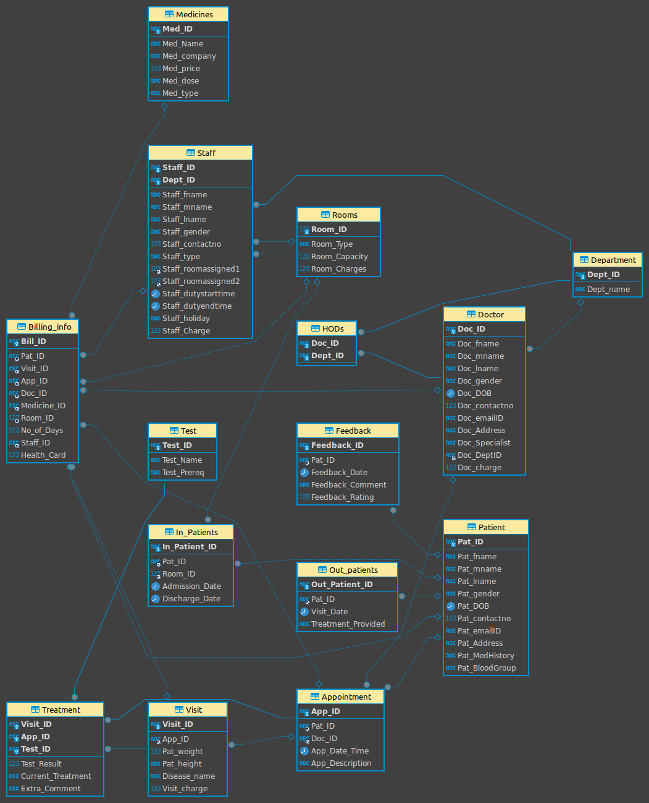

# 🏥 Hospital Management Database System (HMDB)

A fully normalised relational database for managing hospital operations — built in SQL from ground up, progressing through every stage of normalisation (1NF → 2NF → 3NF → BCNF) and extended with stored procedures, triggers, and advanced queries.

---

## 📁 Project Structure

```
hospital_dbms/
├── assets/
│   ├── HMDB.svg                    # Entity-Relationship Diagram (vector)
│   ├── HMDB.png                    # ERD (raster)
│   ├── HMDB1.png                   # Alternate ERD view
│   └── HMDB crttable.png           # phpMyAdmin table overview screenshot
│
├── docs/                           # Design documentation
│   └── Report.pdf   # Project report
│
└── sql/
    ├── 1_initial_schema_and_data/
    │   ├── hmsdb.sql               # Original unnormalised schema (15 tables)
    │   ├── hmsdbs.sql              # Schema with additional constraints
    │   ├── hmsdbins.sql            # Seed data for all 15 tables
    │   └── hmsdb_insaft1nf.sql     # Revised seed data aligned to 1NF schema
    │
    ├── 2_normalization/
    │   ├── hmsdb1nf.sql            # First Normal Form — added MedicalHistory table
    │   ├── hmsdb2nf.sql            # Second Normal Form — extracted Department_Staff
    │   ├── hmsdb3nf.sql            # Third Normal Form — extracted Specialist table
    │   └── hmsdbbcnf.sql           # BCNF — extracted Doctor_Specialist junction table
    │
    └── 3_advanced_features/
        ├── hmsdbfunc.sql           # User-defined function: GetTotalBillingAmount()
        ├── hmsdbproc.sql           # Stored procedures: RegisterPatient, ScheduleAppointment
        ├── hmsdbtrig.sql           # Triggers: IncrementVisitCount, PreventDuplicateAppointment
        └── hmsdbqry.sql            # Analytical queries across all core tables
```

---

## 🗃️ Database Schema
 
The HMDB comprises **15 tables** (InnoDB, utf8mb4) modelling the core entities of a hospital:
 
| Table | Description |
|---|---|
| `Patient` | Demographics: name, DOB, gender, blood group, contact, address |
| `Doctor` | Specialisation, department assignment, consultation charge |
| `Department` | Hospital departments (Cardiology, Neurology, Oncology, etc.) |
| `HODs` | Junction table mapping doctors to their department head roles |
| `Appointment` | Patient–doctor consultations with datetime and description |
| `Visit` | Per-visit vitals (weight, height), diagnosis, and visit charge |
| `Treatment` | Test results and treatment notes per visit |
| `Test` | Diagnostic tests and their prerequisites |
| `Medicines` | Drug catalogue with price, dose, type, and manufacturer |
| `Rooms` | Room types (ICU, Private, General Ward, etc.) with charges |
| `Staff` | Non-doctor staff: nurses, pharmacists, lab techs, admin, security |
| `In_Patients` | Admitted patients with room assignment and admission/discharge dates |
| `Out_patients` | Walk-in patients with visit date and treatment provided |
| `Billing_info` | Composite bill linking patient, visit, doctor, medicine, room, and staff |
| `Feedback` | Patient satisfaction ratings (1–5) and comments |
 
---
 
## 🔢 Normalisation Journey
 
The schema was designed iteratively, with each stage eliminating a specific class of data anomaly:
 
| Stage | File | Key Change |
|---|---|---|
| **Unnormalised** | `hmsdb.sql` | `Pat_MedHistory` stored inline on `Patient`; `Staff` composite PK `(Staff_ID, Dept_ID)` mixing staff and department concerns |
| **1NF** | `hmsdb1nf.sql` | Extracted `MedicalHistory` table; all attributes atomic; proper primary keys on every table |
| **2NF** | `hmsdb2nf.sql` | Removed partial dependency — `Staff` given single-column PK; department assignment moved to `Department_Staff` junction table |
| **3NF** | `hmsdb3nf.sql` | Removed transitive dependency — `Doc_Specialist` and `Doc_charge` determined by specialisation, not doctor; extracted to `Specialist` table |
| **BCNF** | `hmsdbbcnf.sql` | Every determinant is a candidate key — doctor-to-specialisation is a many-to-many relationship; resolved via `Doctor_Specialist` junction table |
 
---
 
## ⚙️ Advanced SQL Features
 
### User-Defined Function — `hmsdbfunc.sql`
 
```sql
GetTotalBillingAmount(p_patID VARCHAR(10)) RETURNS DECIMAL(10,2)
```
Computes total spend for a patient by summing medicine prices and room charges across all their bills.
 
---
 
### Stored Procedures — `hmsdbproc.sql`
 
| Procedure | Description |
|---|---|
| `RegisterPatient` | Inserts a new patient record with auto-incremented ID; normalises email to lowercase |
| `ScheduleAppointment` | Books an appointment using `UUID()` for the appointment ID |
 
---
 
### Triggers — `hmsdbtrig.sql`
 
| Trigger | Event | Action |
|---|---|---|
| `IncrementVisitCount` | `AFTER INSERT ON Visit` | Increments `Visit_Count` on the `Patient` record |
| `PreventDuplicateAppointment` | `BEFORE INSERT ON Appointment` | Raises `SQLSTATE 45000` if the same patient already has an appointment with the same doctor on the same date |
 
---
 
### Analytical Queries — `hmsdbqry.sql`
 
- Full patient information retrieval
- Appointment details with patient and doctor names (3-table JOIN)
- Doctor specialisations and department affiliations
- Visit records with diagnosis and appointment context
- Billing summary with patient name resolution
- Complete medicines catalogue
---
 
## 📐 Entity-Relationship Diagram
 

 
---
 
## 🚀 Getting Started
 
### Prerequisites
- MySQL 8.0+
- MySQL Workbench, DBeaver, or the `mysql` CLI
### Setup
 
```bash
# 1. Clone the repository
git clone https://github.com/<your-username>/hospital-dbms.git
cd hospital-dbms
 
# 2. Run the final normalised schema (BCNF) — this also creates the HMDB database
mysql -u root -p < sql/2_normalization/hmsdbbcnf.sql
 
# 3. Load seed data
mysql -u root -p HMDB < sql/1_initial_schema_and_data/hmsdbins.sql
 
# 4. Load advanced features
mysql -u root -p HMDB < sql/3_advanced_features/hmsdbfunc.sql
mysql -u root -p HMDB < sql/3_advanced_features/hmsdbproc.sql
mysql -u root -p HMDB < sql/3_advanced_features/hmsdbtrig.sql
 
# 5. Run analytical queries
mysql -u root -p HMDB < sql/3_advanced_features/hmsdbqry.sql
```
 
> **Note:** Each normalisation file (`hmsdb.sql` through `hmsdbbcnf.sql`) begins with `DROP DATABASE HMDB; CREATE DATABASE HMDB;` — run them individually to inspect each normalisation stage, or jump straight to BCNF for the final schema.
 
---
 
## 🤝 Contributing
 
Pull requests are welcome. For major changes, please open an issue first to discuss what you would like to change.
 
---
 
## 📄 License
 
This project is for academic and educational purposes.
 
---
 
## 👤 Authors

**Tayme** — [GitHub](https://github.com/pukkahb)
**Esther Idowu**
